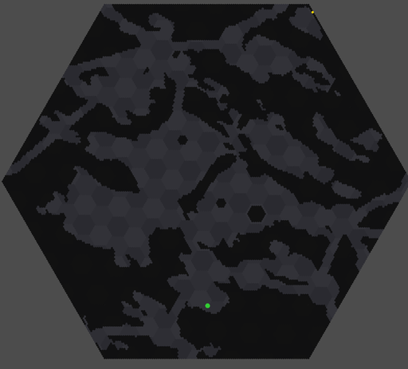
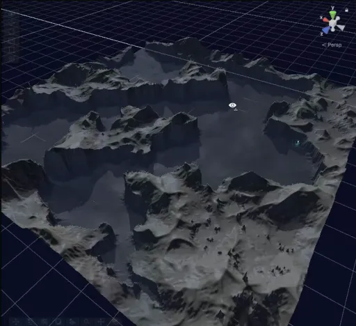
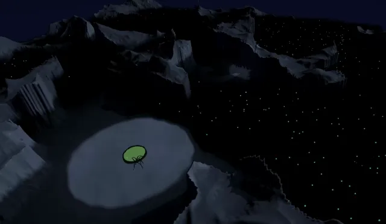
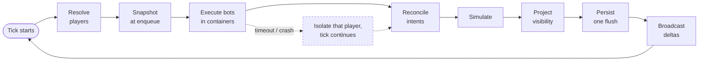

# Screeps2 — an authoritative tick engine for untrusted bots, built for 24 languages

<!-- budget:hook max=90 -->
A programmable game where players write bots, and the bots play. A .NET 10 server runs every
player's bot every second in a Docker sandbox — built for 24 languages; Python, JavaScript and
TypeScript run live today — and streams the world to a Unity 3D client.

Designed and built solo over ~10 months by Andreas Sjögren — I make the decisions and review every merge; AI coding agents implement under gates I built (see Working with agents).

Backend .NET engineer. A write-up of a private project; no buildable source ([why](#why-there-is-no-source-here)).
<!-- /budget -->

## What I built

<!-- budget:built max=260 -->
- **A tick engine that runs every bot, every second.** Twelve ordered phases inside a 1,000 ms
  budget; the tick waits for every script, and replay tests check that identical inputs produce
  byte-identical output. [→](docs/04-tick-pipeline-and-determinism.md)
- **A sandbox built for 24 languages.** One language-neutral contract over 75 Docker images; every
  bot gets a CPU budget, a 200 ms hard kill, a 256 MiB ceiling and a 1 MiB output cap. Three
  languages run live today. [→](docs/02-polyglot-sandbox.md)
- **Warm workers.** One long-lived process per player over a versioned JSON-line protocol:
  1–5 ms per player per tick, down from 50–100 ms. [→](docs/03-persistent-worker-protocol.md)
- **Fog of war, server and client.** Per-player vision bitmaps with per-cell line of sight on the
  server — structure vision cached for a 38% cut at 5,000 entities — and one URP fullscreen pass
  on the client. [→](docs/06-fog-of-war.md) · [numbers →](docs/05-performance-engineering.md#two-more-briefly)
- **A server that is the trust boundary.** Private data is absent from the wire, every full-state
  path is projected per player, and regression tests assert on the serialised bytes.
  [→](docs/09-trust-boundary.md)
- **A Unity 3D client.** URP, 122 scripts, six modules in a compile-time-enforced graph, procedural
  creatures, and a no-install browser watch client. [→](docs/11-world-and-visual-identity.md)
- **A seamless procedural world.** Terrain is one function of global coordinates, eroded as a
  whole and sliced into rooms afterwards. [→](docs/11-world-and-visual-identity.md#the-maps-shape)
- **A player API with one rule** — hide engine mechanics, never do the player's programming: no
  `findClosest`, no rooms, one continuous world — and a [live, hand-written reference](https://edes0.github.io/polyglot-tick-engine/player-api/).
  [→](docs/07-domain-model.md#the-api-design-line)
- **The harness around it.** 1,603 .NET tests and 247 worker tests passing in CI (2026-09-20),
  9 BenchmarkDotNet suites with dated baselines, and an agent workflow I built.
  [→](docs/08-testing-and-ci.md) · [→](docs/10-working-with-agents.md)
<!-- /budget -->

<!-- strip:start -->
<table><tr>
<td width="33%"> Nov 2025 — Godot, 2D hexagons</td>
<td width="33%"> May 2026 — Unity 3D terrain</td>
<td width="33%"> Jun 2026 — a colony's clearing</td>
</tr></table>

[How the world took shape →](docs/11-world-and-visual-identity.md)
<!-- strip:end -->

## How it works

A player's script runs **once per tick against a frozen snapshot** and returns *intents* — "move
toward here", "gather that". The engine decides what actually happens. Intents apply on the same
world tick they were computed for; there is no background queue and no drain-results-next-tick.

## By the numbers

| | |
|---|---|
| Backend | 942 C# files, ~80k LOC across Domain / Application / Infrastructure / Presentation and a small script-tester tool |
| Sandbox | Built for 24 languages: 75 Docker images, 181 files in the execution layer alone; 3 languages live on the worker protocol |
| Tests | **1,603 passing .NET test cases**, plus 222 pytest and 25 Node cases covering the in-container worker entrypoints (CI, 2026-09-20) |
| Benchmarks | 9 BenchmarkDotNet suites, 4 committed baselines dated May–July 2026 |
| Client | Unity 6 / URP, 122 scripts, six assembly-definition modules in a compile-time-enforced DAG |
| History | 379 commits, 222 merged PRs, first commit 2025-11-02, solo |

**Scale caveat, stated up front:** this is pre-alpha with no external players. Every performance
number in this repository was measured at 100 / 1,000 / 5,000 simulated entities on one desktop
(Ryzen 7 7700X, .NET 10). They are not production throughput figures and are not presented as any.
What they demonstrate is the measurement discipline — see
[Performance engineering](docs/05-performance-engineering.md).

## Engineering decisions

The problems that shaped it, and what I chose. All eleven, one screen each: [the decisions](docs/decisions.md).

- **I measure before I believe myself.** My written explanation of a 13× regression covered 2.8% of the allocation; per-call-site counters put 94.5% in the pathfinder. [→](docs/decisions.md#9-instrument-before-refactoring)
- **I reverse my own designs.** Async bot calls lost determinism, so the tick now waits for every script behind a 200 ms kill. [→](docs/decisions.md#3-lockstep-inside-the-tick)
- **Isolation, then speed.** Bots moved out of the server into containers, then into warm workers: 50–100 ms → 1–5 ms per player per tick. [→](docs/decisions.md#2-a-long-lived-worker-per-player)
- **The client is hostile.** Two leaks fixed by removing data from the wire, not the screen. [→](docs/decisions.md#6-the-server-is-the-trust-boundary)

## The write-up

| Page | What it covers |
|---|---|
| [Decisions](docs/decisions.md) | Eleven decisions, each on one screen |
| [01 System overview](docs/01-system-overview.md) | The four layers, the once-a-second loop, and what the client is |
| [02 Sandboxed polyglot execution](docs/02-polyglot-sandbox.md) | The language contract, the limits, and what happens when a bot fails |
| [03 Persistent-worker protocol](docs/03-persistent-worker-protocol.md) | The long-lived worker, its wire format, and the timeout rule |
| [04 Tick pipeline and determinism](docs/04-tick-pipeline-and-determinism.md) | The twelve phases, the replay tests, and move-conflict resolution |
| [05 Performance engineering](docs/05-performance-engineering.md) | The benchmarks, a 13× regression, and where it landed |
| [06 Fog of war](docs/06-fog-of-war.md) | Server vision bitmaps and the client's fullscreen fog pass |
| [07 Domain model](docs/07-domain-model.md) | Aggregates, value objects, ADRs, and the player-API rule |
| [08 Testing and CI](docs/08-testing-and-ci.md) | The suites, the CI lanes, and what a green build does not prove |
| [09 The trust boundary](docs/09-trust-boundary.md) | What the server may send, the public/private line, the two auth schemes |
| [10 Working with AI agents](docs/10-working-with-agents.md) | How the agent workflow is run and checked |
| [11 The world and its look](docs/11-world-and-visual-identity.md) | Four engines, three map shapes, and captures from each |
| [Player API reference](https://edes0.github.io/polyglot-tick-engine/player-api/) (live) | The bot-facing API, written for bot authors |

## Stack

.NET 10 · ASP.NET Core · EF Core · MediatR · Docker · WebSockets / SignalR · xUnit ·
BenchmarkDotNet · Unity 6 (URP, HLSL) · GitHub Actions

## Why there is no source here

Keeping the source private is a decision, not an omission. The engine is a game I intend to keep
building and eventually run, and publishing it would mean publishing a working server that anyone
could stand up as their own. So this repository carries the parts that survive being read rather than
executed: architecture, protocols, decisions, measurements, and short excerpts of the real code —
quoted with the path they came from, so you can see what the code actually looks like without
receiving a copy of it.

If you are evaluating me and want to read more of it, ask — [sjogrenandreas@live.se](mailto:sjogrenandreas@live.se).

## Licence

Prose, diagrams and images: CC BY-NC-ND 4.0. Code excerpts: all rights reserved, reproduced here
for illustration only. See [LICENSE.md](LICENSE.md).

---

**Andreas Sjögren** — [sjogrenandreas@live.se](mailto:sjogrenandreas@live.se) · [github.com/Edes0](https://github.com/Edes0)
