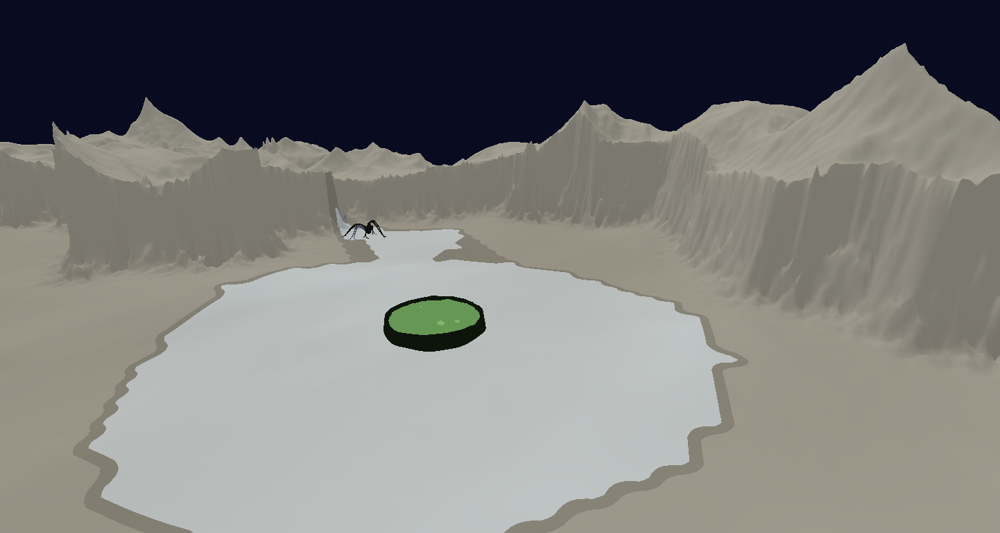

# Screeps2 — an authoritative tick engine that runs untrusted bots in 24 languages

**Engineering write-up of a private project.** This repository contains no buildable source —
see [Why there is no source here](#why-there-is-no-source-here). It is the design, the decisions,
the measurements, and enough real code to judge the rest.

---

## What it is

Screeps2 is a programmable idle game. A player writes a bot — in any of 24 languages — and it runs
forever on a shared world. The player drops in to watch the colony work, tweaks the bot, and drops
out again. There is no client-side simulation: a .NET 10 backend owns the world, advances it once
per second, and the Unity client renders the deltas.

The interesting part is not the game. It is what the game forces you to build:

- **Untrusted code, on purpose.** Every tick, every player's arbitrary code executes in a Docker
  container with a CPU budget, a hard kill, a memory ceiling and an output cap. One player's
  infinite loop cannot delay another player's results, and cannot delay the tick.
- **24 languages, one contract.** bash, C, C++, C#, F#, Clojure, Go, Groovy, Haskell, Java,
  JavaScript, Kotlin, Lua, OCaml, Perl, PHP, PowerShell, Python, R, Ruby, Rust, Scala, Swift,
  TypeScript — 75 Docker images across the version matrix. The host does not know which language
  it is talking to.
- **A 1,000 ms wall-clock budget** that has to contain container round-trips, pathfinding for every
  unit, conflict resolution, persistence, per-player visibility projection, and the broadcast.
- **Determinism as a hard invariant.** Same inputs, byte-identical outputs — enforced by replay
  tests, not by convention.

## What's worth reading

| | |
|---|---|
| [Sandboxed polyglot execution](docs/02-polyglot-sandbox.md) | 24 language runtimes behind one interface; resource limits; fault classification; why adding a language is a descriptor and not a branch |
| [The persistent-worker protocol](docs/03-persistent-worker-protocol.md) | A versioned JSON-line protocol over two transports, and the enqueue-time snapshot that closes a race with tick advancement |
| [Tick pipeline and determinism](docs/04-tick-pipeline-and-determinism.md) | 12 ordered phases, one mutation batch, a four-level total order, and a design I reversed |
| [Performance engineering](docs/05-performance-engineering.md) | How a 13× regression was caught, why my first hypothesis was wrong, and the three optimisations I rejected with measurements |
| [Fog of war](docs/06-fog-of-war.md) | Server-side bitmap vision and a client-side post-process — with the same addressing function written twice, once in C# and once in HLSL |
| [Domain model](docs/07-domain-model.md) · [Testing and CI](docs/08-testing-and-ci.md) · [System overview](docs/01-system-overview.md) | The DDD layer, the test strategy, and how the pieces fit |

**Live:** the [player API reference](https://edes0.github.io/polyglot-tick-engine/player-api/) —
hand-written, for the people who write bots against this engine.

## The tick

A player's script runs **once per tick against a frozen snapshot** and returns *intents* — "move
toward here", "gather that". The engine decides what actually happens. Intents apply on the same
world tick they were computed for; there is no background queue and no drain-results-next-tick.

## By the numbers

| | |
|---|---|
| Backend | 940 C# files, ~80k LOC across Domain / Application / Infrastructure / Presentation |
| Sandbox | 24 language families, 75 Docker images, 181 files in the execution layer alone |
| Tests | **1,350 xUnit tests**, plus 155 pytest and 25 Node cases covering the in-container worker entrypoints |
| Benchmarks | 8 BenchmarkDotNet suites, 4 committed baselines with dated before/after numbers |
| Client | Unity 6 / URP, 118 scripts, six assembly-definition modules in a compile-time-enforced DAG |
| History | 378 commits, 218 merged PRs, ~10 months, solo |

**Scale caveat, stated up front:** this is pre-alpha with no external players. Every performance
number in this repository was measured at 200 / 1,000 / 5,000 simulated entities on one desktop
(Ryzen 7 7700X, .NET 10). They are not production throughput figures and are not presented as any.
What they demonstrate is the measurement discipline — see
[Performance engineering](docs/05-performance-engineering.md).

## Stack

.NET 10 · ASP.NET Core · EF Core · MediatR · Docker · WebSockets / SignalR · xUnit ·
BenchmarkDotNet · Unity 6 (URP, HLSL) · GitHub Actions

## Why there is no source here

The engine is a solo project I intend to keep building and eventually run as a game. Publishing it
would mean publishing a working server that anyone could stand up as their own. So this repository
carries the parts that survive being read rather than executed: architecture, protocols, decisions,
measurements, and short excerpts of the real code — quoted with the path they came from, so you can
see what the code actually looks like without receiving a copy of it.

If you are evaluating me and want to read more of it, ask — [sjogrenandreas@live.se](mailto:sjogrenandreas@live.se).

## Licence

Prose, diagrams and images: CC BY-NC-ND 4.0. Code excerpts: all rights reserved, reproduced here
for illustration only. See [LICENSE.md](LICENSE.md).

---

**Andreas Sjögren** — [sjogrenandreas@live.se](mailto:sjogrenandreas@live.se) · [github.com/Edes0](https://github.com/Edes0)
