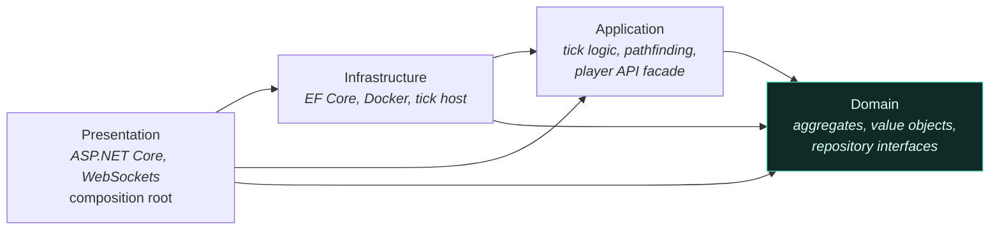

# System overview

[← back to the index](../README.md)

Four .NET projects, one dependency rule, and a loop that runs once a second.

<!-- budget:inshort max=60 -->
> **In short.** **Problem:** my first design let script results arrive after their tick had closed, and
> determinism went with it. **Decision:** lockstep — the tick awaits every player's script, and a hard
> kill bounds the wait. **Outcome:** same inputs, same world; tick time is bounded by the slowest
> script, and the 200 ms kill caps that.
<!-- /budget -->

---

## The layers



The rule that matters: **Domain depends on nothing.** No EF, no MediatR, no IO, no framework at
all. It is 8,000 lines of aggregates, value objects and domain services that could be compiled
against any host. Everything above it may depend downward and never upward, which is what makes the
domain testable without a database and what keeps game rules from leaking into persistence code.

Presentation is the composition root and the only authoritative host: it owns the tick loop, the
database, the HTTP API and the WebSocket broadcast. There is no second writer.

| Project | Owns | Size |
|---|---|--:|
| `Screeps2.Domain` | Aggregates, value objects, domain services, repository interfaces | 116 files |
| `Screeps2.Application` | Tick reconciliation, pathfinding, vision, the player API facade, CQRS handlers | 292 files |
| `Screeps2.Infrastructure` | EF Core, Docker execution, persistent workers, tick hosting, broadcast | 442 files |
| `Screeps2.Presentation` | HTTP API, WebSockets, DI composition, startup validation | 85 files |

## The loop

```mermaid
sequenceDiagram
    autonumber
    participant H as Tick host
    participant S as Script scheduler
    participant C as Docker containers
    participant R as Reconciliation
    participant DB as Database
    participant W as WebSocket clients

    H->>S: resolve runnable players (deterministic order)
    S->>S: capture per-player snapshot at enqueue time
    S->>C: tick message per player (parallel)
    C-->>S: intents, or timeout / crash
    Note over S,C: a player that times out is dropped from<br/>this tick only; the others are unaffected
    S->>R: all intents for this tick
    R->>R: pathfind, resolve traffic conflicts, apply rules
    R->>DB: one batched flush
    DB-->>H: persisted state
    H->>W: per-player visibility-projected delta
```

## Lockstep-in-tick, and the design I reversed

The orchestrator **awaits every player's script inside the tick** before any action is processed.
There is no background script worker, no async overflow buffer, no drain-results-next-tick.

It did not start that way. The first design called player scripts over HTTP asynchronously: a tick
would close its intent buffers, advance, and *then* the script's intents would arrive — landing in
the next tick's buffer, or in an overflow store, or nowhere. The symptom players would have seen was
units stuttering, acting on one-to-two-tick-old decisions, sometimes dropping an action entirely.
The symptom I saw was that determinism was gone: the same inputs no longer produced the same world.

Lockstep removes the ordering bug and buys a real cost in exchange: **tick wall-clock is bounded by
the slowest player's script.** That is an acceptable trade only because the per-script hard kill
bounds the tail — which is why the [execution limits](02-polyglot-sandbox.md#the-limits) are part of
the tick design rather than a safety afterthought.

The orchestrator itself is deliberately thin. It runs an ordered phase list and owns exactly one
thing beyond that — when the mutation batch opens:

```csharp
// src/Screeps2.Infrastructure/Services/Tick/TickOrchestratorService.cs
public async Task<TickExecutionResult> ExecuteTickAsync(
    IReadOnlyList<IPlayerRuntimeDescriptor> players,
    CancellationToken cancellationToken = default)
{
    var state = new TickPipelineState { InputPlayers = players };
    // Opened when the pipeline reaches the first mutation phase so per-action handler saves
    // defer to the single end-of-tick flush; held for the rest of the tick.
    IDisposable? mutationBatch = null;
    try
    {
        foreach (var phase in _phases)
        {
            if (mutationBatch is null && phase.BeginsMutationBatch)
                mutationBatch = _tickMutationContext.BeginBatch();

            if (await phase.ExecuteAsync(state, cancellationToken) == TickPhaseOutcome.Halt)
                break;
        }
        // …
    }
    finally
    {
        mutationBatch?.Dispose();
        if (state.Result is not { Success: true })
            _tickFinalizer.Abort();
    }
}
```

The phases, their order, and what the mutation batch is for are in
[Tick pipeline and determinism](04-tick-pipeline-and-determinism.md).

## What the client is, and is not

The Unity client is a **visualiser**. It fetches the room once over REST, then consumes a
zlib-compressed WebSocket delta stream. It applies spawn and unit calls optimistically for
responsiveness and the next delta confirms or corrects them. It never decides gameplay state — if
the client and the server disagree, the client is wrong by construction.

That split is what makes the second client cheap: a browser viewer is a different renderer over the
same feed, not a second implementation of the game.

---

**Next:** [Sandboxed polyglot execution →](02-polyglot-sandbox.md)
