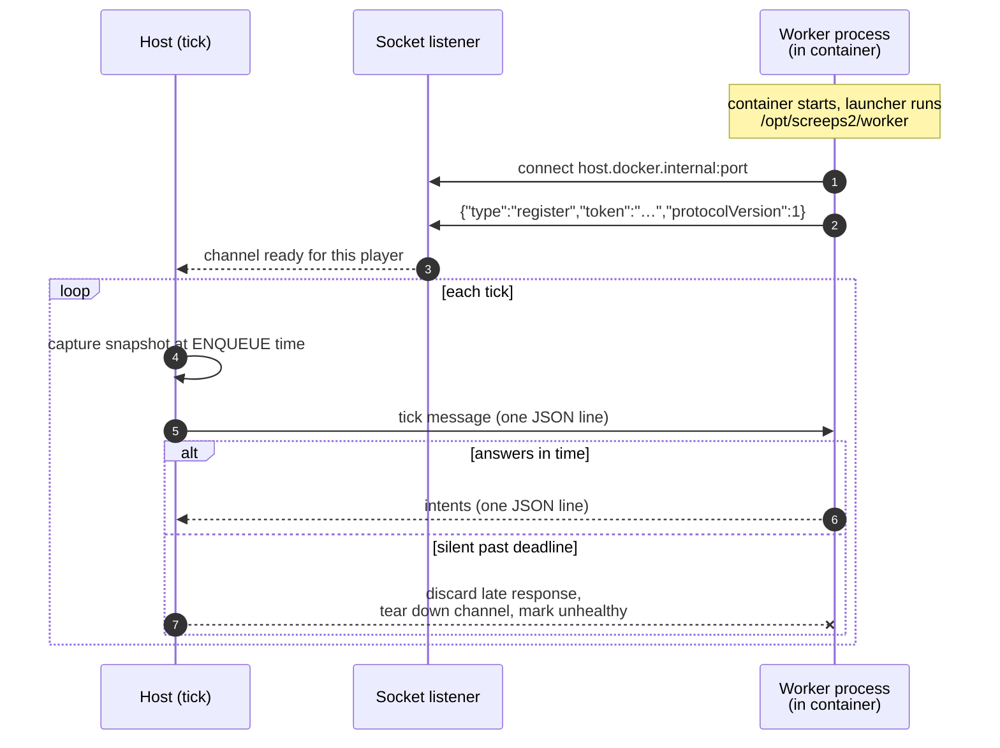

# The persistent-worker protocol

[← back to the index](../README.md)

Starting a process per player per tick is a thousand milliseconds of `docker exec` you do not have.
So the process stays up, and the host talks to it over a versioned line protocol it can hang up on.

---

## Why a long-lived worker

The naive execution path — spin up a container, run the script, read stdout, tear it down — costs
process startup and an HTTP round-trip on every player on every tick. At a 1,000 ms budget shared
across every player, that overhead is most of the budget before any bot has thought about anything.

A persistent worker is one long-lived process per player container. It receives a **tick message**
and replies with **intents**. Startup is paid once. The interpreter stays warm, the JIT stays warm,
and a bot can keep in-process caches between ticks without asking the engine for a storage feature.

What it costs: the host is now responsible for liveness, for a protocol version, and for hanging up
on a worker that stops answering. Those are the three things the design is mostly about.



## The contract

Newline-delimited JSON, one line per message, in both directions. Every message carries
`protocolVersion` so the shape can migrate without guessing.

**Host → worker:**

```json
{
  "protocolVersion": 1,
  "tickNumber": 42,
  "executionId": "guid-string",
  "gameState": {
    "time": 42,
    "memory": "{\"counter\":3}",
    "units": [ { "id": "…", "x": 0, "y": 0, "unitType": "basic", "health": 100,
                 "tags": { "role": "harvester" } } ],
    "structures": [ { "id": "…", "x": 0, "y": 0, "type": "hatchery", "health": 200, "tags": {} } ]
  },
  "constants": { "gatherRange": 2.0, "transferRange": 2.0, "roomGridRadius": 1 },
  "cpuTimeoutMs": 150,
  "deadlineUtc": "2026-01-15T12:00:00.000Z",
  "token": "auth-token-for-api-calls"
}
```

The worker replies with the intents the bot produced. That is the whole surface.

A few decisions inside that payload are worth pulling out:

- **`memory` is an opaque string the engine never parses.** It is the player's blob, owner-private,
  shipped whole each tick. An LLM-written bot can put anything in it without the protocol needing to
  know what. The engine's job is to carry it, not to schematise it.
- **`constants` are sent, not hardcoded.** A worker predicting whether a gather will succeed needs
  the gather range. Shipping it means the client-side prediction can never drift from the server
  rule. The backend stays authoritative for validation regardless; these are for prediction only.
- **`roomGridRadius` is optional, and its absence means "skip the check".** When it is missing the
  worker does not guess a world extent — because a wrong extent reports real ground as wall, and a
  frontier-seeking bot then walks into the void forever. `0` is a legitimate single-room world, not
  a disabled sentinel. Distinguishing "unset" from "zero" is the entire bug that rule prevents.

## The race the snapshot closes

The obvious implementation captures game state when the worker is about to run. That is wrong, and
it is wrong in a way that only shows up under load.

Player scripts are dispatched in parallel. Between scheduling a worker and that worker actually
being handed its message, the tick can advance. Capture at run time and a slow player gets state
from a tick that is no longer the one they are computing for — so their intents apply to a world
that has already moved, non-deterministically, depending on scheduling.

So the snapshot is captured at **enqueue** time, when the orchestrator schedules the execution,
before anything advances. The message carries the state that belongs to `tickNumber`, by
construction. The worker never fetches state at run time; if a snapshot is attached, it uses it and
makes no API call at all.

This is the same class of bug as the async-HTTP ordering failure that produced
[lockstep-in-tick](01-system-overview.md#lockstep-in-tick-and-the-design-i-reversed) — state and
time disagreeing because they were read at different moments.

## Two transports, one abstraction

Socket is the default: the host listens on TCP, the worker dials `host.docker.internal` and sends a
one-time register message with a token from its environment. Stdio is the fallback, attaching to the
worker process's stdin/stdout through Docker.

The channel manager does not know which it got:

```csharp
// src/Screeps2.Infrastructure/Sandbox/PersistentWorker/IWorkerTransportStrategy.cs
/// <summary>
/// Starts a persistent worker for a container and returns a connected line stream.
/// Hides socket-vs-stdio mechanics (env, tokens, connection wait) from the channel manager.
/// </summary>
public interface IWorkerTransportStrategy
{
    Task<IPersistentWorkerStream?> ConnectAsync(
        PlayerId playerId,
        string containerId,
        string workerEntrypointCommand,
        CancellationToken cancellationToken);
}
```

`ConnectAsync` returning `null` rather than throwing is deliberate: a worker failing to come up is
an expected outcome on a hot path that must not unwind, not an exception.

Channels are cached per player in a `ConcurrentDictionary` and evicted after an idle-tick threshold,
so an inactive colony stops holding a process open.

The host invokes `/opt/screeps2/worker` and nothing else. Whether that path is a shell script
exec'ing Python or a compiled Go binary is the image's business.

## The timeout rule

**The host enforces the deadline. The worker is never trusted to.**

`deadlineUtc` and `cpuTimeoutMs` are in the message so a well-behaved worker can bail out early and
return partial work. That is a courtesy, not a mechanism. A worker that has wedged cannot report
that it has wedged — so the host holds its own timer, and on expiry it discards any late response
(it belongs to a tick that has closed), tears down the channel, and marks the worker unhealthy. The
tick proceeds without that player.

## A cost I measured and have not yet paid down

Terrain is a pure function of `(room, worldSeed)`, so the host builds it once per tick and hands the
same array to every player. But it ships in full every tick: nine rooms at 14,400 bytes, base64'd
over uncompressed newline-delimited JSON is roughly **216 KB per player per tick** of data that
never changes.

Sending it once at handshake, keyed by world seed, is the obvious fix. It is written down as a known
improvement and it is not implemented, because at current scale it is not the constraint — the same
reasoning that
[parked three other optimisations](05-performance-engineering.md#three-optimisations-i-did-not-do).
Writing the number down is what makes it a decision rather than an oversight.

---

**Next:** [Tick pipeline and determinism →](04-tick-pipeline-and-determinism.md)
