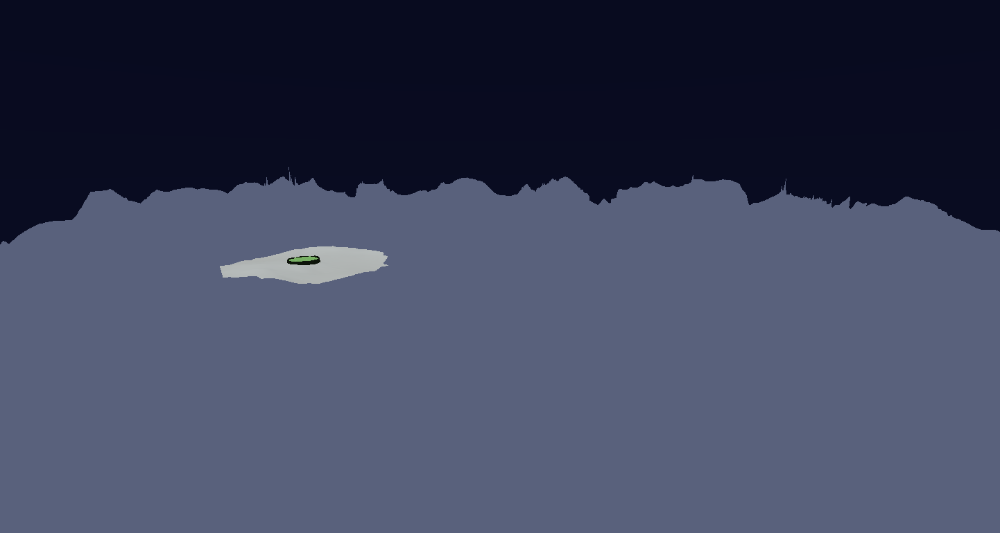
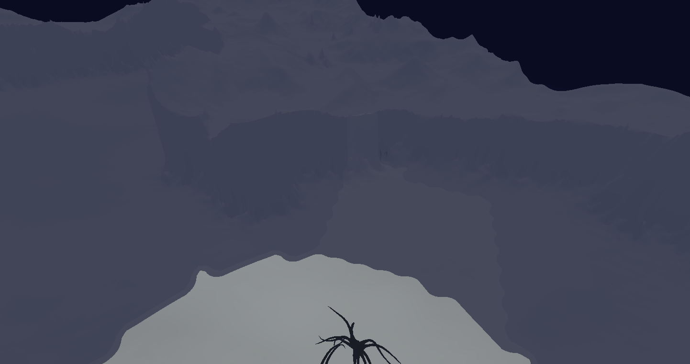
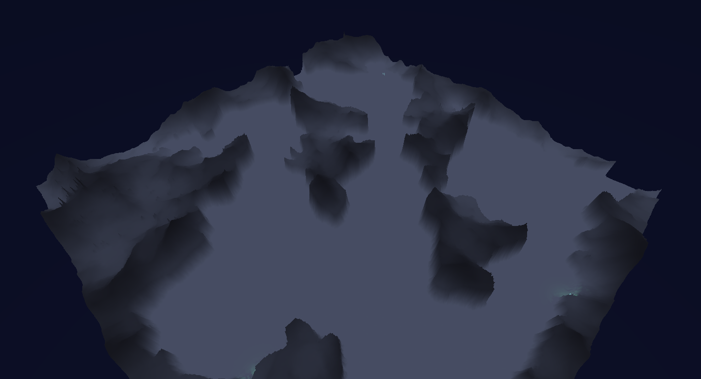
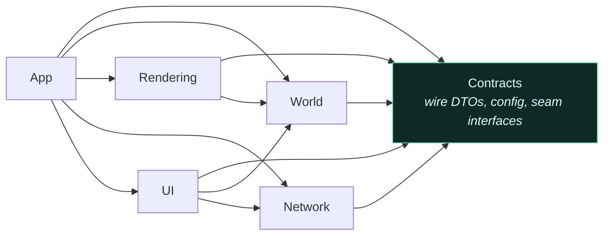

# Fog of war

[← back to the index](../README.md)

The same addressing function exists twice — once in C#, once in HLSL — and they have to agree
exactly, forever. Here is why that was the right trade.

<!-- budget:inshort max=60 -->
> **In short.** **Problem:** fog is a rule on the server and an effect on the client, and conflating
> them leaks information. **Decision:** the server omits what a player cannot see; the client renders
> fog in one fullscreen pass, not per shader. **Outcome:** a new material cannot leak the world, at the
> price of one mapping written twice, pinned by tests.
<!-- /budget -->

---

## Two halves of one feature

Fog of war is a **rule** on the server and an **effect** on the client, and conflating them is how
you leak information.

The server decides what each player may know. Vision is rasterised per player into per-room bitmaps
— a Euclidean disc or cone per unit, with per-cell Bresenham line-of-sight so a mountain actually
blocks sight rather than merely looking like it should. What a player cannot see is not dimmed in
the payload; it is absent from it. A bot cannot read a hostile it cannot see, because the value was
never serialised for that player.

The client then has to make that legible: three states, no hard edges, no popping, something that
reads as atmosphere rather than a stencil.

## How it looked while it was being built

These are development captures from the session where the post-process was written. They are debug
frames, not marketing shots.

**Flat, before any fog or lighting** — the terrain mesh and a small visible clearing around the
colony. Correct, and dead.



**Volumetric fog, over-tuned** — two fog layers doing their job and then some. Atmospheric, and
close to unplayable: you cannot see your own units.



**The three states, with soft borders** — unseen, explored, and visible, blended rather than
stencilled, with the fog height ramp driven by distance from vision.



**Tuned** — the visible region reads clearly, explored terrain stays legible, and the unseen world
recedes without becoming a black hole.


Between those frames sit the settings that did not survive: a red debug fog, a UV-gradient pass, a
forced all-visible mode, several height-ramp attempts. The debug frames are the useful ones — when
fog looks wrong there is no way to tell a bad density curve from a wrong UV without rendering the UV
directly.

## The architecture change that made it tractable

Fog started as per-shader sampling: every material that drew anything sampled the visibility texture
and dimmed itself. That means every new shader must remember to implement fog, and any shader that
forgets silently leaks the world.

It is now a single URP fullscreen pass running at `BeforeRenderingTransparents`, gating every opaque
pixel. One implementation. A new material cannot forget, because it is not involved.

The pass reconstructs world XZ from depth, samples visibility, blends three state weights, and
composites two independent volumetric layers — each with its own colour, density, cloud-noise
strength, scale, contrast and drift, sharing only a slab plane and its wobble. It also depth-gates
the skybox out, and masks the volume to the map footprint: the visibility texture is clamp-wrapped,
so without that mask the fog volume fills the entire half-space below the slab in every direction
and reads as a fog sphere following the camera across empty space.

That is the kind of bug you only diagnose by rendering the intermediate value.

## The duplicated function

The visibility texture is one square atlas of (2R+1)² room regions, laid out so that atlas adjacency
mirrors world adjacency. That matters: a single atlas-wide distance-field pass and bilinear soft
borders then flow across room seams for free, instead of every room boundary becoming a visible
discontinuity.

Addressing it requires the same mapping in two languages. The C# side is pure — no `UnityEngine`
dependency, so it is unit-testable in EditMode without a texture:

```csharp
// frontend/screeps2/Assets/Scripts/World/FoWAtlas.cs
public static class FoWAtlas
{
    /// <summary>Atlas square dimension in cells: (2·radius+1)·gridSize. Radius 0 ⇒ gridSize.</summary>
    public static int AtlasDim(int gridSize, int radius) => (2 * radius + 1) * gridSize;

    /// <summary>
    /// Maps a room's grid coords to its atlas block (col = roomX+radius, row = roomY+radius).
    /// Returns false when the room is outside the configured radius — the caller's bounds guard
    /// against a backend grid wider than the client's.
    /// </summary>
    public static bool TryRoomColRow(int roomX, int roomY, int radius, out int col, out int row)
    {
        col = roomX + radius;
        row = roomY + radius;
        return roomX >= -radius && roomX <= radius && roomY >= -radius && roomY <= radius;
    }

    /// <summary>
    /// Row-major flat index for cell (x,z) of the room block at atlas (col,row). At radius 0
    /// this reduces to z·gridSize + x — the pre-atlas single-room index (byte-identity).
    /// </summary>
    public static int CellOffset(int col, int row, int x, int z, int gridSize, int atlasDim)
        => (row * gridSize + z) * atlasDim + (col * gridSize + x);
}
```

And the shader mirror:

```hlsl
// frontend/screeps2/Assets/Shaders/Includes/FogOfWar.hlsl
float2 FoW_WorldToAtlasUV(float2 worldXZ)
{
    float gridSize = _VisibilityAtlasParams.x;
    float radius   = _VisibilityAtlasParams.y;
    float2 step    = max(_VisibilityAtlasParams.zw, 1e-4);                 // guard div-by-zero
    float2 room    = clamp(floor(worldXZ / step), -radius.xx, radius.xx);  // which room owns this pixel
    float2 local   = worldXZ - room * step;                               // local cell in [0, gridSize)
    float2 cell    = (room + radius) * gridSize + local + 0.5;            // atlas cell space, +0.5 = texel centre
    return cell * _VisibilityWorldScale.xy;                               // × 1/atlasDim
}
```

Duplicated logic is a defect by default. This one is deliberate, and it carries three things that
make it survivable:

1. **A stated invariant.** At radius 0 the atlas index reduces to the pre-atlas single-room index,
   *byte-identically*. The generalisation is provably a superset of what it replaced, so the change
   could ship without re-verifying every existing behaviour.
2. **A testable half.** The C# side has no engine dependency and is covered by EditMode tests, so
   the arithmetic is pinned even though the GPU side cannot be unit-tested.
3. **A written rule at the call site.** Any new sampler of the visibility texture must go through
   `FoW_WorldToAtlasUV` rather than compute its own UV. It is recorded as a numbered gotcha, because
   the failure mode — a sampler that is subtly off by half a texel at room seams — is invisible
   until someone screenshots exactly the wrong spot.

The alternative was pushing the mapping into a lookup texture to keep one implementation. That would
add a per-pixel dependent texture read to the hot fullscreen pass to save seven lines of arithmetic
the GPU does in registers. I have not benchmarked the lookup-texture version; that is reasoning, not
a measurement, and it is labelled as such here. The layout choice that *was* made explicitly — one
atlas texture over a texture array, one bind and one sample — is recorded in the fog spec.

## Where the fog gets its shape

Two signals, deliberately separate:

- **The state gate** uses the sharp visibility sample — unseen / explored / visible, softened by a
  blur wide enough to cross the one-cell limit of raw bilinear filtering.
- **The height ramp** uses a per-tick chamfer distance field: world distance from each cell to the
  nearest currently-visible cell. A true distance field, not a blur, so the fog bank rises with
  actual distance from vision and small scattered visible pockets do not wash the fog out around
  themselves.

One atlas-wide chamfer pass and one texture upload per tick, regardless of how many rooms changed.

## The client module boundaries

The client is six assemblies with a compile-time-enforced dependency graph:



Contracts is a leaf. When Rendering needs something the app layer owns, it depends on an interface
in Contracts — `IUnitProximityQuery`, `IWorldStateApplier`, `IEntityPanelDataProvider` — rather than
reaching upward. There is no `InternalsVisibleTo` anywhere; crossing a boundary requires being
`public`, which makes every crossing deliberate and visible in review.

Unity does not enforce architecture for you. Assembly definitions are the one mechanism that turns a
layering intention into a compile error, which is why the client has six of them instead of one
`Assembly-CSharp`.

---

**Next:** [Domain model →](07-domain-model.md)
