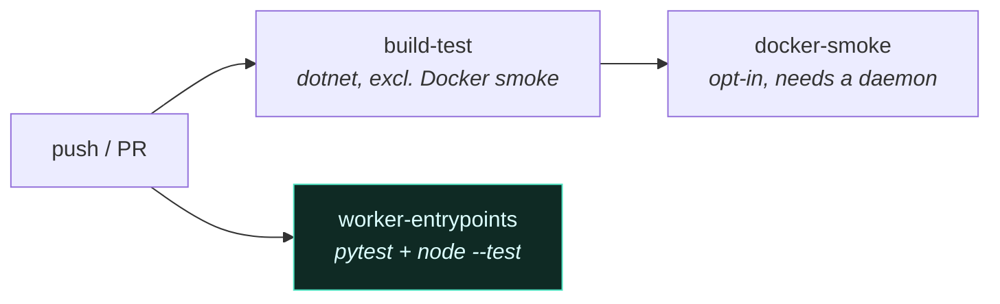

# Testing and CI

[← back to the index](../README.md)

1,350 tests is a number. The useful parts are the two suites that exist because .NET cannot reach
them, and the rule that a green build proves less than it looks like it proves.

---

## What exists

| Suite | Tests | Covers |
|---|--:|---|
| `Screeps2.Infrastructure.Tests` | 481 | DbContext, executors, persistent worker, Docker smoke |
| `Screeps2.Application.Tests` | 456 | Tick reconciliation, handlers, wire-format contracts |
| `Screeps2.Domain.Tests` | 269 | Aggregates, value objects, replay determinism |
| `Screeps2.Presentation.Tests` | 144 | Controllers, startup configuration guards |
| `tests/python` | 155 | The Python worker entrypoint |
| `tests/javascript` | 25 | The JS/TS worker entrypoint |

Roughly 36,000 lines of test code against 80,000 lines of source. Plus 8 BenchmarkDotNet suites with
[four committed baselines](05-performance-engineering.md).

## The suites that exist because `dotnet test` cannot reach them

The worker entrypoints live *inside* the Docker images — `docker/images/python/worker_entrypoint.py`,
and its JavaScript counterpart. They implement the player-facing half of the
[tick protocol](03-persistent-worker-protocol.md): parse the tick message, build the `game` object
the bot sees, collect intents, write the response line.

No .NET test touches that code. It is not referenced by the solution. A completely green backend
build says exactly nothing about whether a Python bot can still read `game.units`.

This is not hypothetical. The Python suite sat red on master for weeks after a coordinate-model
change, while CI was green the entire time, because CI only ran .NET.

So CI has three lanes:

`worker-entrypoints` runs independently of `build-test` on purpose — no .NET at all — so a worker
regression cannot be masked by an unrelated backend failure, and so it still reports when the
backend build is broken. The test harness puts the image directory on the import path, so the
entrypoint is importable without building the image.

### A green run that was testing one thing instead of sixteen

One of those Node files needs `--experimental-test-isolation=none`. Under the default isolation it
reports **1 test instead of 16 — and passes.** Silently. The count is the only signal that anything
is wrong.

The cause: the file's fresh-worker helper calls `process.chdir`, which the isolated runner does not
survive. The sibling test file has no `chdir` and is fine under plain `node --test`, which is what
makes it confusing — one file works, one file quietly does almost nothing. Running the directory
form is also wrong: both files land in one process and the `chdir` breaks the other file's relative
paths.

The flag is in the CI invocation with a comment explaining what it buys, because a future cleanup
that removes an "unnecessary experimental flag" would turn fifteen tests off without turning
anything red.

### Asserting on output that deliberately escapes your capture

Both worker entrypoints bind their real stderr **at load time**, on purpose, so worker diagnostics
still reach the container log while the bot's tick call has its streams captured. Which means a test
fixture installed after load is bypassed by design: pytest's `capsys` and `capfd` both come back
empty even while pytest's own report displays the text.

The first instinct is to "fix" the worker. The worker is correct — that separation is the feature.
So the tests reach through the seam instead: Python patches the module's captured stderr handle, and
the JS side installs its sink *before* the require. Both suites had already been made red once by
an assertion that tested the fixture rather than the behaviour.

## A green suite is not evidence of wiring

The rule I ended up writing down, after four separate incidents reached it independently:

> A green `dotnet build` plus a green xUnit run says nothing about DI composition, middleware order,
> EF model discovery, or hub routing. Unit tests construct their subjects directly and never
> exercise the host.

Every one of those four was the same shape: tests passed, the application did not start, or started
and did nothing. A service registered in the wrong lifetime. An aggregate with no repository routed
into the persistence switch, where the default arm throws — invisible to every test that used a
mock, fatal on the first real tick.

So changes to registration, middleware, migrations or the hub are gated against a **running**
Presentation host: hit the endpoint, watch the tick log, then call it done. Tests are the fast loop.
They are not the proof.

The same logic applies to the Unity client, which `dotnet build` does not compile at all, and to the
Docker images, where the build step skips images that already exist — so worker edits run stale
until the image is rebuilt, and everything looks fine while doing so.

## What I would tell you in an interview

The test count is the least interesting fact on this page. The parts I would defend are:

- The **replay determinism tests**, which pin a property rather than a value, and which catch a class
  of mistake — `Parallel.ForEach`, hash-set iteration order — that no amount of example-based
  testing would.
- The **benchmark baselines**, which turned a 13× performance regression from something nobody would
  have noticed into something that surfaced the next time the file was opened.
- The **worker-entrypoint suites**, because knowing which code your test suite structurally cannot
  reach is worth more than the coverage percentage of the code it does.

---

[← back to the index](../README.md)
