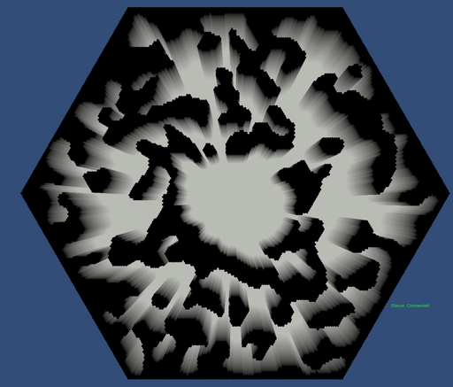
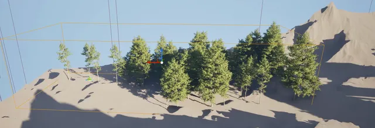
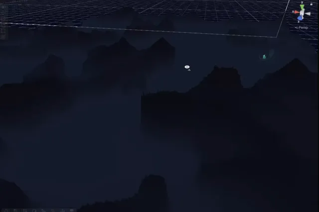

# The world and its look

[← back to the index](../README.md)

This is my first game, built solo, and it found its look by being built four times. The map changed
shape as it went — hexagons, then chunks, then rectangles, then one seamless world — because each
engine and each bug taught me something about what a world for bots has to be.

<!-- budget:inshort max=60 -->
> **In short.** **Problem:** a solo first game needed a look, and bots needed a world without seams
> to trip over. **Decision:** four client engines tried and one kept; hexagons given up for
> rectangles, then for one continuous world. **Outcome:** Unity 3D, a seamless map, and coordinates
> that behave the way a bot author expects.
<!-- /budget -->

---

## Four engines, one kept

### Godot, 2D hexagons — November 2025

*Godot, 2025-11-06. The first world: one hexagonal room, generated rock veins, one unit.*

The first client was a minimal Godot frontend, and the world was a hexagonal room. It lasted six days.
The commit that ended it is titled "We gonna go to Unity". My reasons were the fit with the backend —
C# on both sides of the wire — plus Unity's asset ecosystem, its tooling, and the fact that I already
knew I would want 3D. The migration plan written at the time names the same things: full 3D lighting,
an orthographic camera for a strategy-game view, and the asset store.

### Unity, still 2D hexagons — November 2025

*Unity, 2025-11-15. The same hexagonal room, now rendered by a client connected to the live server.*

The Unity 2D client kept the hexagonal grid and grew it: by the end of November there were 49
hex-named files across the backend and the client.

### Unreal, procedural 3D — December 2025 to February 2026

*Unreal Engine, 2025-12-07. Procedurally placed trees on generated terrain.*

Then I went looking for a look. Unreal's procedural content framework could fill a landscape with
forests and rock that Unity 2D could not, so the next client was Unreal — and the commit that moved to
it deleted every hex file in the project, all 49, and declared hexagonal coordinates obsolete. The
world became procedural chunks.

It did not last either. Unity can build for the browser and Unreal no longer can, and I wanted a
browser client — a no-install watch client later shipped exactly that way. And honestly,
Unreal was too much engine for one person learning to make a first game: everything took longer to
build and longer to learn than the game could afford.

### Unity 3D — from February 2026

*Unity 3D (URP), 2026-05-22. Eroded terrain on the rectangular room grid.*

Five days after the Unreal commit, a Unity 3D project using the Universal Render Pipeline replaced it.
That is the client today: Unity 6, URP, and the six-module assembly structure described in
[fog of war](06-fog-of-war.md#the-client-module-boundaries).

What made four clients survivable is that none of them owned the game. The simulation lived in its
own backend project from the first commit, and a client renders what it is sent. Each switch still
meant real backend work — the switch commits touched between 33 and 321 backend files, as data shapes
and world generation changed — but the game's rules were never the thing being rewritten. That is
what "the server is authoritative" buys you when you change your mind.

## The map's shape

**Hexagons, then rectangles.** The Unreal move removed the hexagons. When the world came back to
Unity it was a grid of rectangular rooms, and a later spec locked that in plainly: the world is
rectangles now, and the old hexagonal coordinate machinery must not come back. The last piece of it —
an interface of axial hex coordinates and hex rings with no implementation and no caller — was deleted
in September.

**Rectangles, then no seams at all.** Rooms were still a generation unit, and anything generated
per room had an edge. The rule that fixed it is recorded as a decision: gameplay terrain is a pure
function of global coordinates, with **no per-room overlay**, because any room-local overlay silently
re-introduces a discontinuity at the seams. Erosion followed: instead of eroding each room separately,
one pass erodes the whole field and the result is sliced into rooms afterwards, so water flows across
what used to be borders. At a single-room world the output is byte-identical to the old one, so the
change could not quietly alter a map that already existed.

Rooms did not go away. They became what they should have been from the start: an internal compute
partition for occupancy, pathfinding and fog, invisible to players. That line — and the stale
comments that nearly convinced both me and an agent to delete rooms outright — is in
[the domain model](07-domain-model.md#rooms-are-a-compute-partition-never-a-player-concept).

## The coordinate system

Coordinates changed shape twice, and both times for the same reason: the people writing bots.

1. **Room-local to global.** Bot coordinates used to reset at every room boundary and came with a
   `room=` parameter. The problem statement for changing that is one sentence long: *an LLM's obvious
   "move east until `x > 100`" silently breaks at a seam.* Coordinates are now global and continuous,
   and a bot never learns that rooms exist.
2. **3D to flat 2D.** The bot API had inherited the renderer's Unity 3D convention, including a height
   axis that gameplay never used. The game is top-down and collision only uses the ground plane, so
   the bot API became flat `(x, y)`. The engine's internal position type stays 3D for rendering, and
   the reason it must never be used for gameplay is written into the type itself.

Global coordinates brought a bug with them that is worth knowing about. The world now has negative
coordinates, and Python's `int()` truncates toward zero, so for every negative non-integer
coordinate it lands one cell off — directly under a comment claiming parity with the server's
function. The JavaScript runtime had the same bug through `Math.trunc`. The fix floors first and
divides second, and the rule that came out of it is that any runtime that decomposes a coordinate
needs a parity test against the server, not a comment claiming parity.

## Finding an identity

The design has two pillars, and the first one is about feel: the game is something you drop into and
watch. The rule I wrote for it:

> **Visual feel beats engine throughput** — a 2 s tick that interpolates beautifully beats a 500 ms
> tick that snaps.

That rule changed engineering decisions. Unit movement was slowed to a tenth of its original pace for
watching, then raised to three tenths. The browser watch client exists because the easiest way to
watch is not to install anything.

*2026-05-23. Early volumetric fog over the 3D terrain.*

*2026-06-04. A colony's clearing: what one player can see, and the dark they cannot.*

And the creatures that live in it:

*Procedural locomotion test, 2026-05-04.*

*Creature model, 2026-05-03.*

How the fog itself was tuned from those early frames to the final look is in
[fog of war](06-fog-of-war.md#how-it-looked-while-it-was-being-built).

---

[← back to the index](../README.md)
